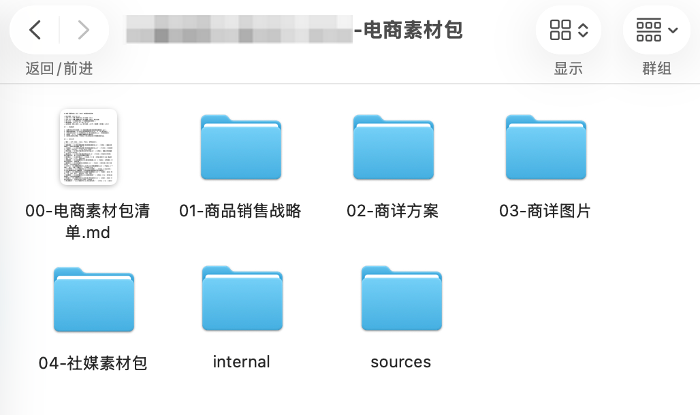
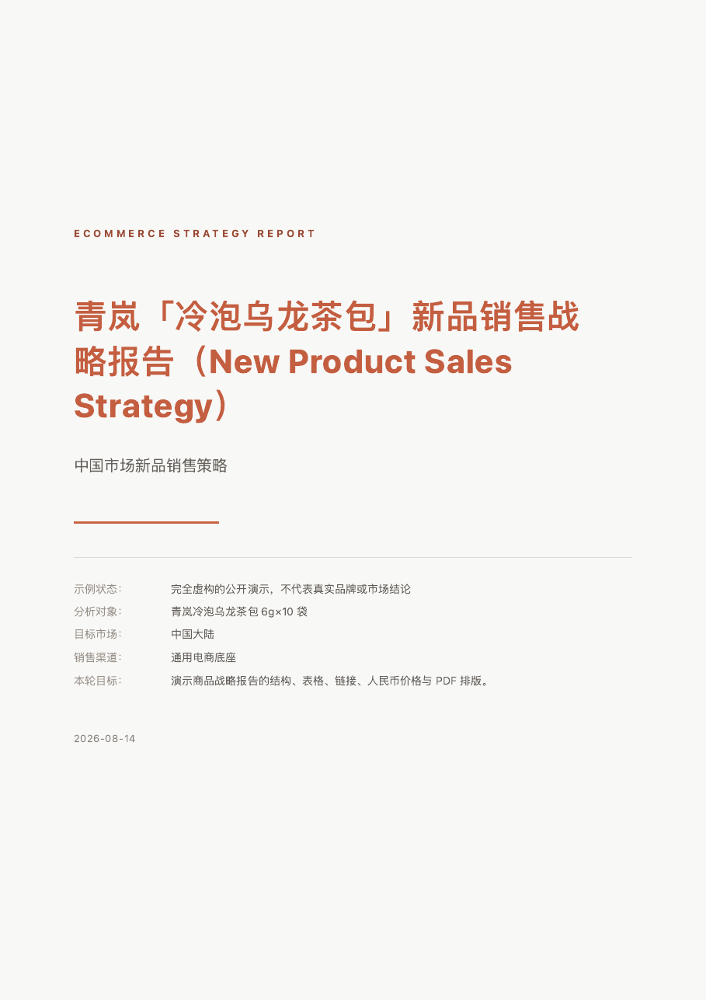
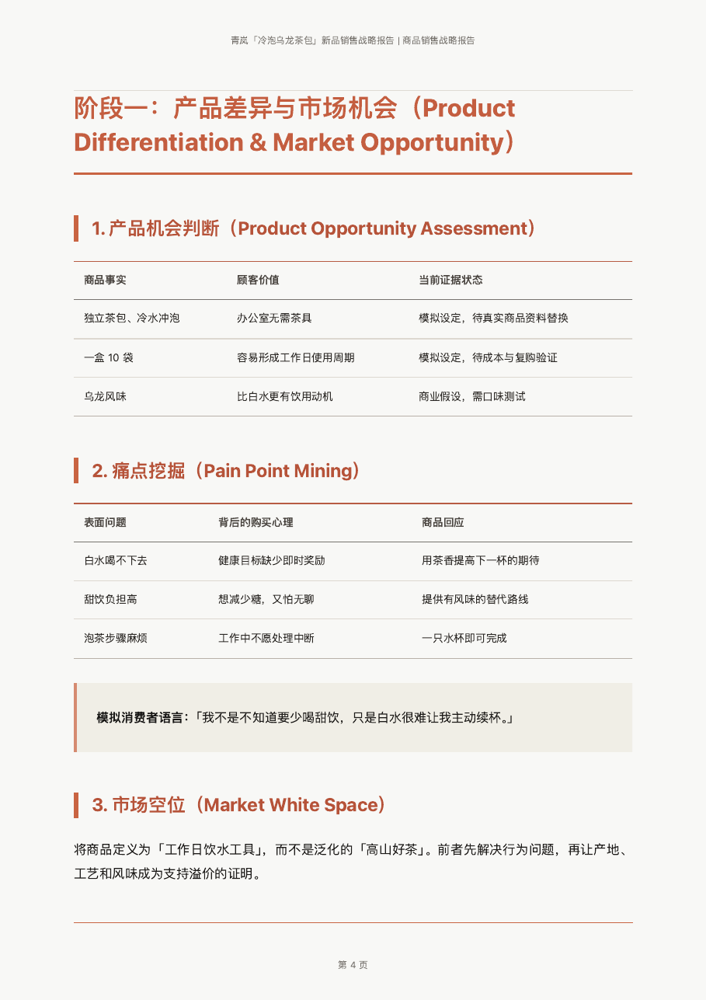

# eCommerce-helper: turn “we have a product, but how do we sell it?” into a complete China eCommerce asset pack


[中文 README](README.md) · [Preview](#preview) · [Who it is for](#who-it-is-for) · [Quick start](#quick-start) · [How to use](#how-to-use) · [Support](SUPPORT.md)

Author/publisher: [Jiaran](https://c.aoao.ai)

`ecommerce-helper` is an AI Skill for launching or improving products in the Chinese market. It mines product facts, competitors, real customer language, price signals, and brand stories to answer three questions first: who will buy, why will they buy, and how much should it cost. It then produces the strategy report, PDP copy, modular product-detail images, and channel-native social content.

> Start with scattered product material and turn “How should this sell?” into a testable, production-ready eCommerce plan.

The hardest part of launching a product is rarely making a few more images. Before meaningful sales data exists, teams still need to decide who is most likely to buy first, why they would pay, which proposition should lead, how SKUs should be structured, and what the RMB price should be—then turn those decisions into a product page and channel-ready content.

You can run the complete workflow or request only research, RMB pricing, PDP copy, images, or one channel pack. Every downstream asset is derived from the same sales strategy so PDP, social, and private-channel execution do not drift apart.

## Preview

A complete run organizes research material, internal synthesis, sales strategy, PDP routes, product-detail images, and social assets into one reviewable and deliverable eCommerce asset pack:



The product sales strategy is delivered both as a Markdown master and a shareable PDF. The report preview below uses a fully fictional product and simulated data to demonstrate the actual public renderer without presenting any market claim as real.

| Strategy report cover | Report body |
|---|---|
|  |  |

Source Markdown: [examples/demo-strategy-report.md](examples/demo-strategy-report.md).

## Who it is for

- brand and product owners looking for a China-market entry angle for a new product;
- importers, distributors, and buyers deciding the first customer, proposition, SKU structure, and RMB price;
- DTC, mini-program, and eCommerce teams that need complete PDPs and production-ready content assets;
- brand and content teams producing Xiaohongshu, private-group, WeChat Moments, and official-account content from one strategy;
- operators repositioning an existing product page or strengthening its proof and persuasion.

> Temporarily not suitable for apparel products.

## Quick start

### Ask an agent to install it (recommended)

Send this one-line request to an agent that supports Skills:

```text
Install ecommerce-helper from https://github.com/Jiaranbb/ecommerce-helper, run scripts/check_environment.py without automatically installing missing dependencies, then remind me to refresh or restart the Skill list and tell me which deliverables are currently available.
```

### Install with commands

Run the complete block:

```bash
git clone https://github.com/Jiaranbb/ecommerce-helper.git
mkdir -p "${CODEX_HOME:-$HOME/.codex}/skills"
cp -R ./ecommerce-helper "${CODEX_HOME:-$HOME/.codex}/skills/"
python3 "${CODEX_HOME:-$HOME/.codex}/skills/ecommerce-helper/scripts/check_environment.py"
```

Refresh or restart the Codex Skill list after installation. Other agents can place the repository in their own Skill discovery directory.

## How to use

### Research a new product and create the complete asset pack

```text
Use $ecommerce-helper to create a complete China eCommerce asset pack for “brand + product.”
Complete the product research, target customer, competitor and review pain points, core proposition, SKU structure, RMB pricing, sales strategy, PDP routes, product-detail images, and social assets. List any missing cost, label, or product-image inputs that I need to provide.
```

### Decide who buys, why they buy, and what the RMB price should be

```text
Use $ecommerce-helper to research “brand + product.”
Only produce the product sales strategy for now, including target customer, review pain points, competitor differences, core proposition, SKU options, and recommended RMB price. Do not generate PDP images yet.
```

### Design multiple PDP routes from existing material

```text
Use $ecommerce-helper to read the product report, supplemental material, and images in “folder path.”
Create 2–3 genuinely different PDP copy routes, mark the recommended route, and stop for copy confirmation before generating images.
```

### Turn confirmed PDP copy into modular images

```text
Use $ecommerce-helper to generate product-detail images from the confirmed final PDP copy and product material.
Create every section as an independent 1080×1440 portrait image, keep one visual system, and visually verify the product, specifications, prices, and Chinese text page by page.
```

### Prepare channel-native social assets

```text
Use $ecommerce-helper to prepare a social content pack from the confirmed product sales strategy.
Create separate copy and image plans for Xiaohongshu, private groups, WeChat Moments, and official accounts. Use native channel language instead of duplicating one post everywhere.
```

## What it produces

- product, customer, competitor, review, brand, price, and transaction research;
- target-customer hypotheses and post-launch validation signals;
- one core selling proposition, supporting mechanisms, proof, and objection handling;
- SKU roles, RMB list price, launch tests, and unit-economics guardrails;
- 2–3 genuinely different PDP copy routes and one final page-by-page script;
- modular 1080×1440 product-detail images when an authorized image tool is available;
- Xiaohongshu, private-group, WeChat Moments, and official-account content;
- a Markdown strategy report plus a shareable A4 PDF.

## Workflow

```text
Scope
→ product research and commercial synthesis
→ strategy report + PDF
→ confirm product, buyer, proposition, and price
→ 2–3 PDP routes
→ confirm final copy
→ visual master and modular images
→ channel-native social pack
→ consistency and file QA
```

The Skill uses a platform-neutral base by default. Platform-specific title, fields, fulfillment, campaign, and content differences are added only when the user requests a directly publishable version for a named platform.

## Environment

Run the read-only checker:

```bash
python3 scripts/check_environment.py
python3 scripts/check_environment.py --json
```

| Capability | Dependency |
|---|---|
| Research and copy | An agent with web research/browser access and local file writing |
| PDF | Python 3.9+, `markdown`, Chrome/Chromium; WeasyPrint is an optional fallback |
| Image generation | A user-authorized image generation/editing tool |
| Image normalization | `ffmpeg` |
| PDF visual QA | `pdfinfo`, `pdftoppm`, or the agent's PDF viewer |

Install the Python base dependency manually when needed:

```bash
python3 -m pip install -r requirements.txt
```

The Skill never installs system or Python dependencies automatically.

The report colophon keeps the eCommerce-helper author credit, public WeChat contact `evadebot`, and personal website [c.aoao.ai](https://c.aoao.ai). This is the Skill author credit. Use the cover option `--author` for a separate client-report byline; the two identities are not merged.

## Privacy and external requests

- Product data, costs, inventory, and outputs are saved to the user-selected local directory.
- Web research sends product names, keywords, and target URLs to the active search/browser provider.
- Cloud image tools may receive user-supplied product images and prompts under that provider's policy.
- Local PDF rendering and image normalization do not require an eCommerce, social, or payment login.
- The Skill does not read cookies, API keys, browser profiles, contacts, or unrelated files.
- It does not publish listings, posts, ads, or messages without separate explicit authorization.

## Limits

- Before first-party sales data exists, buyer, price, and message decisions are testable hypotheses.
- Small review samples can reveal language and objections, not market share.
- Marketing hooks may compress a story, but may not fabricate awards, numbers, efficacy, sales, certifications, or exclusive claims.
- Image quality depends on the chosen model and reference support. Packaging, logos, prices, specifications, and Chinese text require visual QA.
- Platform rules change; verify current official requirements before direct publication.

## Related projects

- [report-helper](https://github.com/Jiaranbb/report-helper) — long-form, source-linked research reports and polished PDFs from one request;
- [content-reader](https://github.com/Jiaranbb/content-reader) — agent skills for saving Xiaohongshu, Twitter/X, YouTube, and Bilibili content;
- [xhs-reader](https://github.com/Jiaranbb/xhs-reader) — save Xiaohongshu posts locally without logging in;
- [pdf-reader](https://github.com/Jiaranbb/pdf-reader) — convert PDFs into Markdown with page markers and quality metrics;
- [dreamy-photo](https://github.com/Jiaranbb/dreamy-photo) — dreamy photo editing while preserving real subject details;
- [autoskin-codex](https://github.com/Jiaranbb/autoskin-codex) — preview-first, reversible themes for the Codex desktop app;
- [jiucai-helper](https://github.com/Jiaranbb/jiucai-helper) — a testable personal investment-decision Skill combining method and discipline.

See more original projects on [Jiaranbb’s GitHub profile](https://github.com/Jiaranbb?tab=repositories).

## About the author

**Jiaran (Jiaranbb)** — independent developer / AI Builder

I turn workflows I genuinely need into reusable AI tools and Skills.

- Website: [c.aoao.ai](https://c.aoao.ai)
- GitHub: [github.com/Jiaranbb](https://github.com/Jiaranbb)
- X/Twitter: [@_jiaran](https://x.com/_jiaran)
- WeChat: `evadebot`
- WeChat official account: **嘉然学习笔记**
- Support: [SUPPORT.md](SUPPORT.md)
- Project issues: [GitHub Issues](https://github.com/Jiaranbb/ecommerce-helper/issues)

## License

MIT-0. See [LICENSE](LICENSE).
