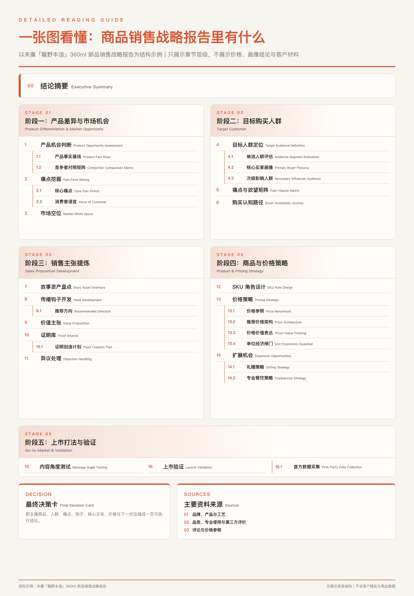

# eCommerce-helper：把「有商品，不知道怎么卖」变成完整电商素材包


[English README](README.en.md) · [效果预览](#效果预览) · [适合谁用](#适合谁用) · [30 秒开始](#30-秒开始) · [怎么用](#怎么用) · [问题反馈](SUPPORT.md)

作者／发布者：[嘉然 Jiaran](https://c.aoao.ai)

`ecommerce-helper` 是一个面向中国市场新品和待优化商品的 AI Skill。它从商品资料、竞品、真实评论、价格和品牌故事中挖掘销售机会，先回答「卖给谁、凭什么买、卖多少钱」，再生成销售战略报告、商详文字、分屏商品图和多渠道社媒素材。

> 从一份商品资料开始，把模糊的「这个商品怎么卖」推进成一套可判断、可测试、可直接制作的电商方案。

新品真正困难的通常不是缺几张图，而是在销售数据尚未形成时，判断「谁最可能先买、为什么愿意买、应该主打什么、SKU 怎么组合、人民币卖多少钱」，并把这些判断落成能够成交的商品详情和能够传播的内容。

既可以运行完整流程，也可以只做商品研究、人民币定价、商详文字、商品图或某一渠道的内容包。所有下游素材从同一份销售战略派生，避免商详、社媒和私域在实际制作时彼此脱节。

## 效果预览

完整流程会把研究资料、内部推演、销售战略、商详方案、商详图片和社媒素材整理成一个可直接查看与交付的「电商素材包」：


其中，商品销售战略报告会同时交付 Markdown 母稿和方便分享阅读的 PDF。下面使用完全虚构的商品与模拟数据，演示公开版真实可生成的报告结构和 PDF 排版：

报告会从结论进入，依次说明产品差异与市场机会、目标购买人群、销售主张、SKU 与价格、上市打法、验证方式和最终决策。下面以酱油案例为结构示例，把每个阶段的主要章节与 `4.1／4.2` 等子标题完整列出，但不展示价格、画像结论或客户材料：



| 战略报告封面 | 正文与决策结构 |
|---|---|
|  |  |

完整示例母稿见 [examples/demo-strategy-report.md](examples/demo-strategy-report.md)。示例中的品牌、商品、价格、销量假设和顾客画像均为虚构数据，不代表真实市场结论。

## 适合谁用

- 正在为新品寻找中国市场切入点的品牌方与商品负责人；
- 需要判断目标顾客、核心卖点、SKU 和人民币售价的进口商、经销商与选品团队；
- 需要完整商品详情与内容素材的独立站、小程序及电商运营团队；
- 希望从同一销售战略生成小红书、私域、朋友圈和公众号内容的品牌与内容团队；
- 已有商品页面，但需要重新定位、补充证据或提高说服力的经营者。

> 暂时不适合服装类的商品。

## 30 秒开始

### 让 Agent 帮你安装（推荐）

把下面这句话直接发给支持 Skills 的 Agent：

```text
请从 https://github.com/Jiaranbb/ecommerce-helper 安装 ecommerce-helper，运行 scripts/check_environment.py 检查环境且不要自动安装缺失依赖；安装完成后提醒我刷新或重启 Skill 列表，并告诉我当前可用的交付能力。
```

### 使用命令安装

复制下面整段命令运行：

```bash
git clone https://github.com/Jiaranbb/ecommerce-helper.git
mkdir -p "${CODEX_HOME:-$HOME/.codex}/skills"
cp -R ./ecommerce-helper "${CODEX_HOME:-$HOME/.codex}/skills/"
python3 "${CODEX_HOME:-$HOME/.codex}/skills/ecommerce-helper/scripts/check_environment.py"
```

安装后刷新或重启 Codex Skill 列表。其他 Agent 也可以把仓库复制到各自的 Skill 发现目录。

## 怎么用

### 从零研究一个新品，并生成完整素材包

```text
Use $ecommerce-helper 为准备进入中国市场的「品牌 + 商品」制作完整电商素材包。
请完成商品研究、目标顾客、竞品与评论痛点、核心卖点、SKU、人民币价格、销售战略、商详方案、商详图片和社媒素材；需要我提供成本、标签或商品图时，请列出资料缺口。
```

### 先判断「卖给谁、凭什么买、卖多少钱」

```text
Use $ecommerce-helper 研究「品牌 + 商品」。
先只输出商品销售战略报告，包括目标顾客、评论痛点、竞品差异、核心卖点、SKU 方案和建议人民币售价；暂时不要生成商详图片。
```

### 用已有资料设计多套商详方案

```text
Use $ecommerce-helper 读取「资料文件夹路径」中的商品报告、补充材料和图片。
基于这些资料提供 2—3 套真正不同的商详文字方案，标出推荐方案；先确认文字，不要生成图片。
```

### 把确认后的商详文案做成分屏图片

```text
Use $ecommerce-helper 根据已经确认的最终商详文字和商品素材生成商详图片。
每个部分制作成一张独立的 1080×1440 竖图，保持统一版式，并逐页检查商品、规格、价格和中文文字。
```

### 准备多渠道社媒素材

```text
Use $ecommerce-helper 根据已经确认的商品销售战略准备社媒素材包。
分别生成小红书、私域群、朋友圈和公众号的文字与配图方案；每个渠道使用原生表达，不要简单复制同一篇文案。
```

## 核心能力

| 模块 | 解决的问题 | 主要交付物 |
|---|---|---|
| 商品研究 | 商品凭什么在中国被购买 | 商品事实、评论痛点、竞品差异、品牌与文化线索 |
| 目标顾客 | 谁最可能先买单 | 候选人群、核心画像、购买任务与认知路径 |
| 销售主张 | 什么最能抓住注意并支撑成交 | 核心卖点、机制、故事资产、证明与异议处理 |
| SKU 与价格 | 卖什么组合、卖多少钱 | 商品角色、人民币日常价、首发测试价、价格底线 |
| 商详 | 如何把判断变成成交页面 | 2—3 套完整文字方案、最终逐屏文案、FAQ 与 CTA |
| 商品图 | 如何形成一致的分屏商详 | 3:4 视觉母版、独立页面、尺寸归一化与逐页 QA |
| 社媒 | 如何按渠道传播同一战略 | 小红书、私域群、朋友圈、公众号及可选增补渠道 |

## 输出目录

完整流程默认生成：

```text
{品牌}-{商品}-电商素材包/
├── 00-电商素材包清单.md
├── sources/
├── internal/
├── 01-商品销售战略/
│   ├── 商品销售战略报告.md
│   └── 商品销售战略报告.pdf
├── 02-商详方案/
│   ├── 商详文字多方案.md
│   └── 最终商详文字.md
├── 03-商详图片/
└── 04-社媒素材包/
    ├── 01-小红书/
    ├── 02-私域群/
    ├── 03-朋友圈/
    ├── 04-公众号/
    └── 05-增补渠道/
```

用户只要其中一个阶段时，Skill 只生成必要文件，不制造空目录。

## 工作流与阶段门

```text
任务确认
→ 商品研究与销售推演
→ 商品销售战略报告＋PDF
→ 确认主推 SKU、顾客、卖点与价格
→ 2—3 套商详文字
→ 确认最终文字
→ 商品图视觉母版与分屏图片
→ 多渠道社媒素材
→ 全包一致性验收
```

用户明确授权自动跑完整流程时，Skill 会采用推荐方向继续；仍会先把每一阶段的文字定稿落盘，再进入图片生产，避免文案随生成图片漂移。

## 通用底座与平台增量

没有指定平台时，直接使用通用电商底座，不追问「到底是淘宝还是独立站」。用户明确要求淘宝／天猫、京东、拼多多、小红书店铺、抖音电商或其他平台可直接上架版本时，再增加平台标题、字段、活动、履约和内容差异。

主体商详图片保持通用的 1080×1440、3:4 独立分屏；平台首图、搜索缩略图、直播卡片和广告素材作为增量资产处理。

## 环境与依赖

先运行只读环境检查：

```bash
python3 scripts/check_environment.py
python3 scripts/check_environment.py --json
```

脚本只检查，不会安装或修改系统依赖。

| 能力 | 必需／可选 | 依赖 |
|---|---|---|
| 商品研究与文字 | 必需 | 支持联网搜索／浏览的 Agent，以及可写入用户指定目录的文件工具 |
| PDF 导出 | 必需于完整素材包 | Python 3.9+、`markdown`、Chrome／Chromium；WeasyPrint 可作回退 |
| 图片生成 | 可选阶段 | 当前 Agent 已配置且获得用户授权的图像生成／编辑工具 |
| 图片尺寸统一 | 图片阶段推荐 | `ffmpeg` |
| PDF 目视 QA | 推荐 | `pdfinfo`、`pdftoppm` 或当前 Agent 的 PDF 查看能力 |

安装 Python 基础依赖：

```bash
python3 -m pip install -r requirements.txt
```

Skill 不会自行执行 `pip install`、`brew install`、`apt install` 或远程脚本。

## 隐私与外部请求

| 数据 | 默认保存位置 | 是否发生外部请求 |
|---|---|---|
| 商品资料、成本、库存和生成结果 | 用户选择的本地输出目录 | 保存本身不发生 |
| 品牌名、商品名、关键词和目标 URL | 本地研究文件 | 联网研究时会发送给当前搜索／浏览服务 |
| 商品图、Logo 和视觉参考 | 用户选择的本地素材目录 | 使用云端生图／编辑工具时会按该工具规则发送 |
| PDF 和图片尺寸处理 | 用户本机 | 默认不联网 |
| 电商、社媒和支付账户 | 不读取 | Skill 不负责登录、上架或发布 |

与 AI 平台的对话和附件仍受所用平台政策约束。Skill 不读取 Cookie、API Key、浏览器配置、通讯录或任务无关文件，也不会自动发布商品、社媒内容、广告或外部消息。

## 质量与限制

- 没有自有销售数据时，目标顾客、价格和内容角度是商业假设，必须通过首发数据校准。
- 评论可以用于发现语言和痛点，但小样本频次不能冒充市场占比。
- 营销表达允许有钩子与修辞，不能捏造具体数字、功效、销量、认证或排他性事实。
- 生图质量依赖所用模型和参考图支持。关键包装、Logo、规格、价格和中文必须逐页目视检查。
- 外部平台规格、规则和价格可能变化；要求直接上架或发布时，应先核查当前平台要求。
- 建议让另一个 AI Agent 对事实、推理链、价格假设和最终图片做一次交叉审查。

## FAQ

**一定要跑完整素材包吗？**
不需要。可以只做战略报告、定价、商详文字、商品图或某一渠道内容。

**没有评论还能做吗？**
可以。Skill 会先使用同品牌同产品线、直接竞品和相邻替代品评论建立方向性假设，并明确评价对象边界。

**为什么不一开始就要商品图？**
战略和商详文字可以先完成。只有进入图片阶段才需要包装、Logo、标签和视觉参考。

**没有图像生成工具怎么办？**
交付最终文字、逐图 Prompt、视觉母版规则和制作清单，不会把 Prompt 冒充成品图片。

**淡口、低盐、天然、健康等宣称会自动纠正吗？**
Skill 会区分品类概念、标签事实和营销修辞，但最终合规仍应由品牌方或专业人员审核。

**如何更新？**
重新运行安装工具或拉取仓库最新版本。更新前保留自己的商品素材包和本地配置；它们不应放进 Skill 目录。

## 相关项目

- [report-helper](https://github.com/Jiaranbb/report-helper) — 一句话启动长篇深度研究，并生成带来源的报告与 PDF；
- [content-reader](https://github.com/Jiaranbb/content-reader) — 保存小红书、Twitter／X、YouTube 和 B 站内容的组合型 Agent Skills；
- [xhs-reader](https://github.com/Jiaranbb/xhs-reader) — 免登录保存小红书笔记到本地；
- [pdf-reader](https://github.com/Jiaranbb/pdf-reader) — 将 PDF 转换成带页码与质量指标的 Markdown；
- [dreamy-photo](https://github.com/Jiaranbb/dreamy-photo) — 保留真实主体细节的梦幻化照片编辑 Skill；
- [autoskin-codex](https://github.com/Jiaranbb/autoskin-codex) — 可预览、可撤销的 Codex 桌面主题定制工具；
- [jiucai-helper](https://github.com/Jiaranbb/jiucai-helper) — 将投资方法和纪律整理成可验证的个人投资决策 Skill。

更多原创项目见 [Jiaranbb 的 GitHub 主页](https://github.com/Jiaranbb?tab=repositories)。

## 关于作者

**嘉然 Jiaran（Jiaranbb）** — 独立开发者／AI Builder

持续把自己真正需要的工作流做成可复用的 AI 工具与 Skills。

- 个人网站：[c.aoao.ai](https://c.aoao.ai)
- GitHub：[github.com/Jiaranbb](https://github.com/Jiaranbb)
- X／Twitter：[@_jiaran](https://x.com/_jiaran)
- 微信：`evadebot`
- 公众号：**嘉然学习笔记**
- 支持与反馈：[SUPPORT.md](SUPPORT.md)
- 项目问题：[GitHub Issues](https://github.com/Jiaranbb/ecommerce-helper/issues)

## License

MIT-0 License。详见 [LICENSE](LICENSE)。
